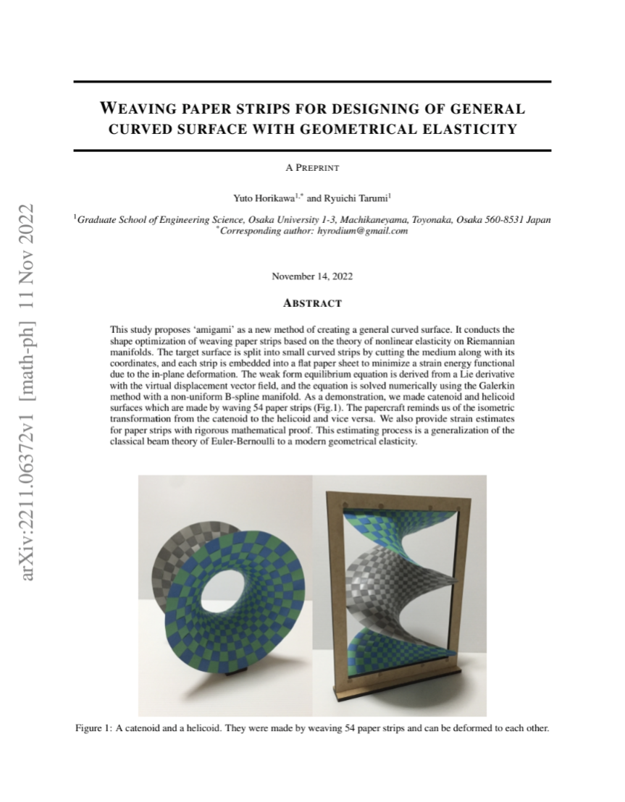
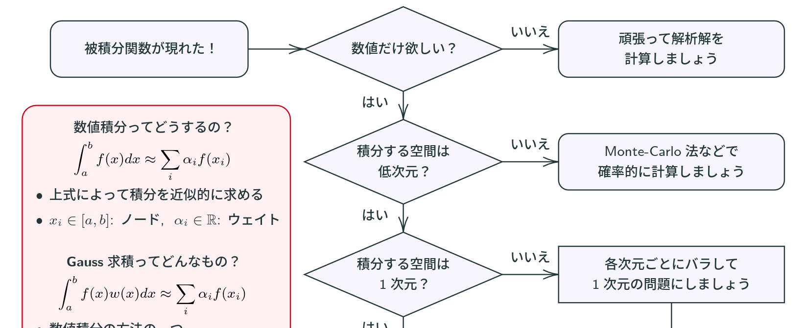
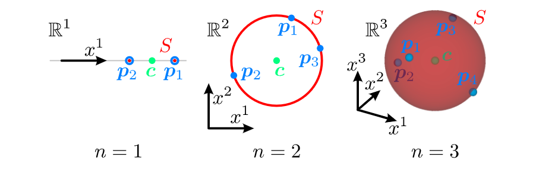
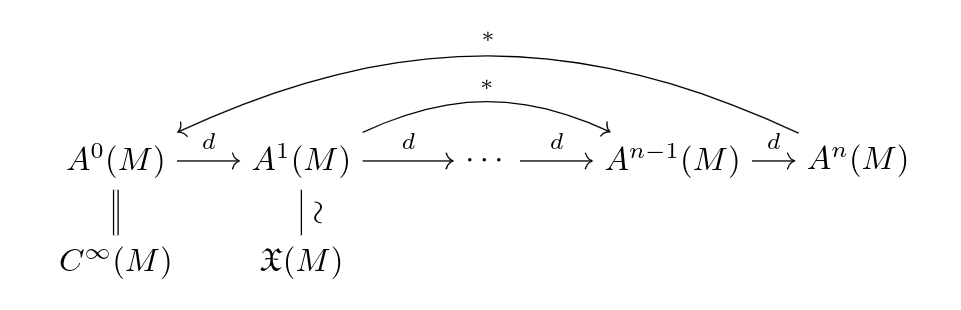
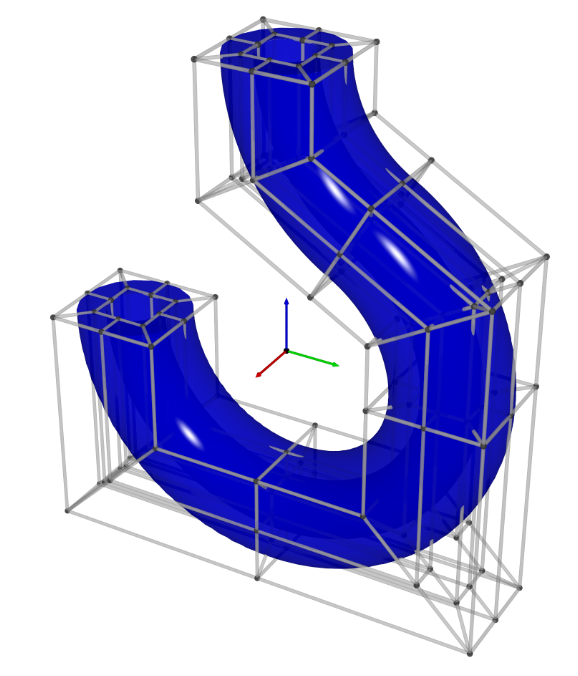
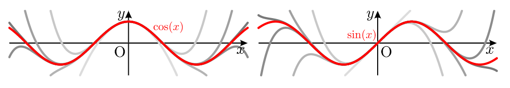
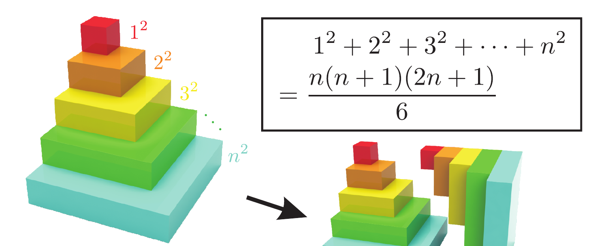
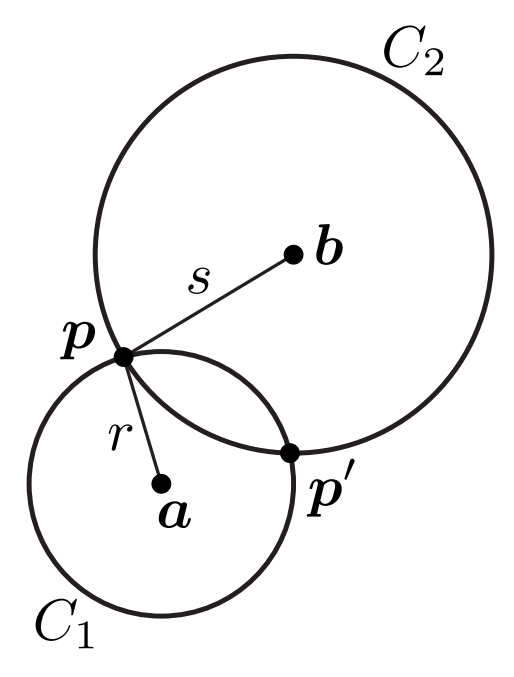

# PDF資料

## Weaving paper strips for designing of general curved surface with geometrical elasticity (English)

**(2022/11/11)**\
初めてarXivに投稿した論文！紙を編んで滑らかな曲面を作る理論です。
日本語解説は[こちら](https://twitter.com/Hyrodium/status/1592133224876363776)。

[arXiv](https://arxiv.org/abs/2211.06372)

## 数値積分フローチャート

**(2021/01/01)**\
数値積分の入門のためにフローチャートを作成しました.
Gauss求積の学習のお伴にどうぞ.

[Overleaf](https://www.overleaf.com/read/sfzqrxbckdwh)
/
[PDF](https://drive.google.com/file/d/1TojTUq4K-c4nqU1V-ZTa53kdFxHqSLzI/view)

## ``n+1``点を通る``n-1``次元球面

**(2019/12/15)**\
``n+1``個の点``\bm{p}_i``が``\mathbb{R}^m (n≤m)``上の一般の位置にあるとき, ``\bm{p}_i``を通る``n-1``次元球面``S⊂ℝ^m``が一意的に存在します.
その球面``S``の中心``\bm{c}``を求める式を導出しました.
これは3角形の外心の一般化でもあります.

[Overlaf](https://www.overleaf.com/read/nnffssqthbsf)
/
[PDF](https://drive.google.com/open?id=1i_fuJQoKcPNZRJoBrZ_K4o6c1SzURgKA)

## Riemann多様体上の発散の同値な定義

**(2019/03/01)**\
多様体にRiemann計量を入れるとベクトル場の発散が定義できますが, その流儀は色々あります.
この文章ではそれらの同値性やそれぞれの利点や幾何的解釈について述べます.

[Overleaf](https://www.overleaf.com/read/gfjtscqftvgz)
/
[PDF](https://drive.google.com/file/d/1G6l0E1bpyb6v0dj85zfBLuvGO5QTNlMo/view)

## NURBS多様体による形状表現

**(2018/12/12)**\
NURBSは区分有理式を用いて曲線や曲面を表現するための手法です.
この手法はB-splineやBézier曲線の一般化であり, CGや数値計算などの分野で使われています.
日本語の文章で数学的にちゃんとした文章が見当たらなかったので書きました.
(実は一部の証明などに間違いがありますが、修正に手が回ってません…)

[Overleaf](https://www.overleaf.com/read/vygnptvqfspd)
/
[PDF](https://drive.google.com/open?id=1JK2tBEXQavGOq2nlkpJyoeQC0QoIUOQ3)

## 微積分に頼らずに幾つかの冪級数を求める

**(2016/02/27)**\
[100 Great Problems of Elementary Mathematics](https://www.amazon.co.jp/dp/B00BOKIWSM)の内容をもとに書いた文章です.
微分や積分を使わずに``\exp(x)``, ``\sin(x)``, ``\cos(x)``の冪級数展開を求めます.

[Overleaf](https://www.overleaf.com/read/cpkzxvzczssn)
/
[PDF](https://drive.google.com/open?id=1otefohLREQurkijJ7Ei_5jFyf-GugiJM)

## 平方数の和

**(2013/03/24)**\
平方数の和の公式を視覚的に求めます.

[PDF](https://drive.google.com/file/d/1i6lOCa_ptqMo4RpHuFUNt-DqVaeWPeWB/view?usp=sharing)

## 平面上の2円の交点の座標について

**(2012/08/11)**\
解析幾何で2つの円の交点を求めます.

[Overleaf](https://www.overleaf.com/read/qykjnbwdfjrj)
/
[PDF](https://drive.google.com/open?id=1cg2xY0FJ3MNmAqzLWA2AUIA64asKhLkY)

## LandauのO-記法の厳密な扱い (執筆中)
Landauの記法``O(x)``とかの厳密な扱いについて書いています.

[Overleaf](https://www.overleaf.com/read/hxrrkzkfrwkv)
